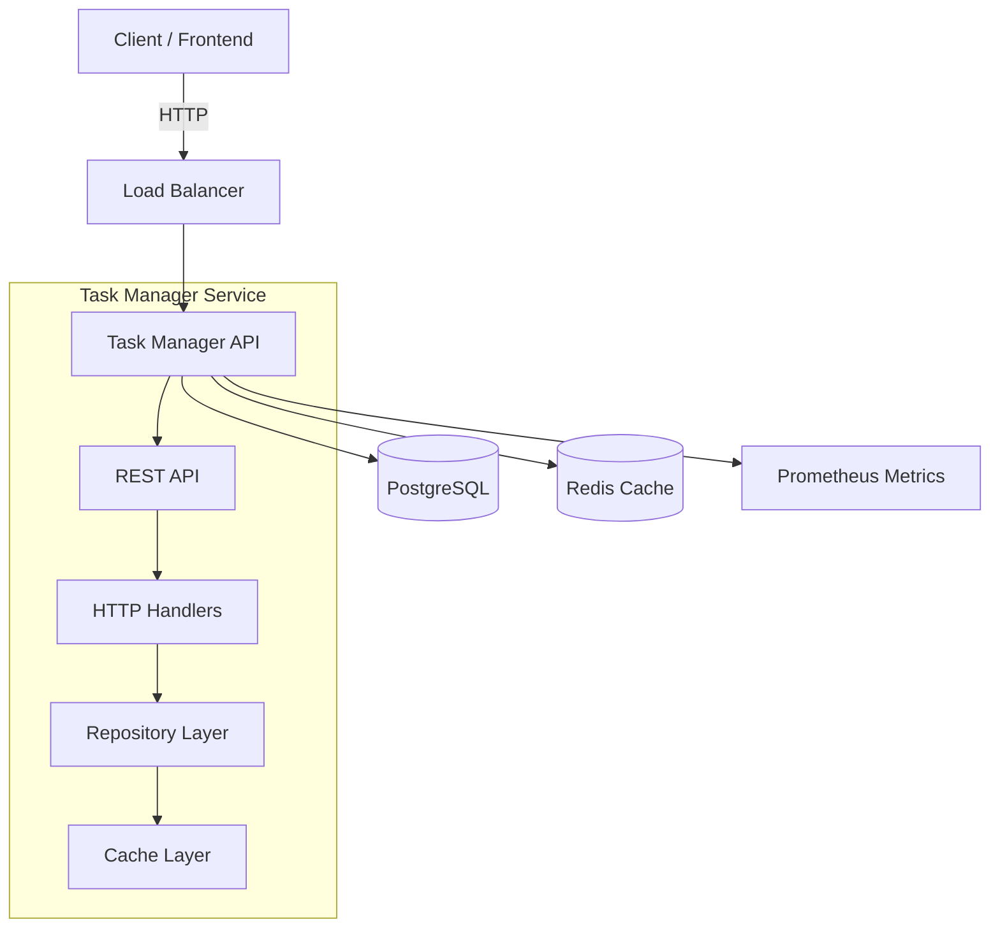
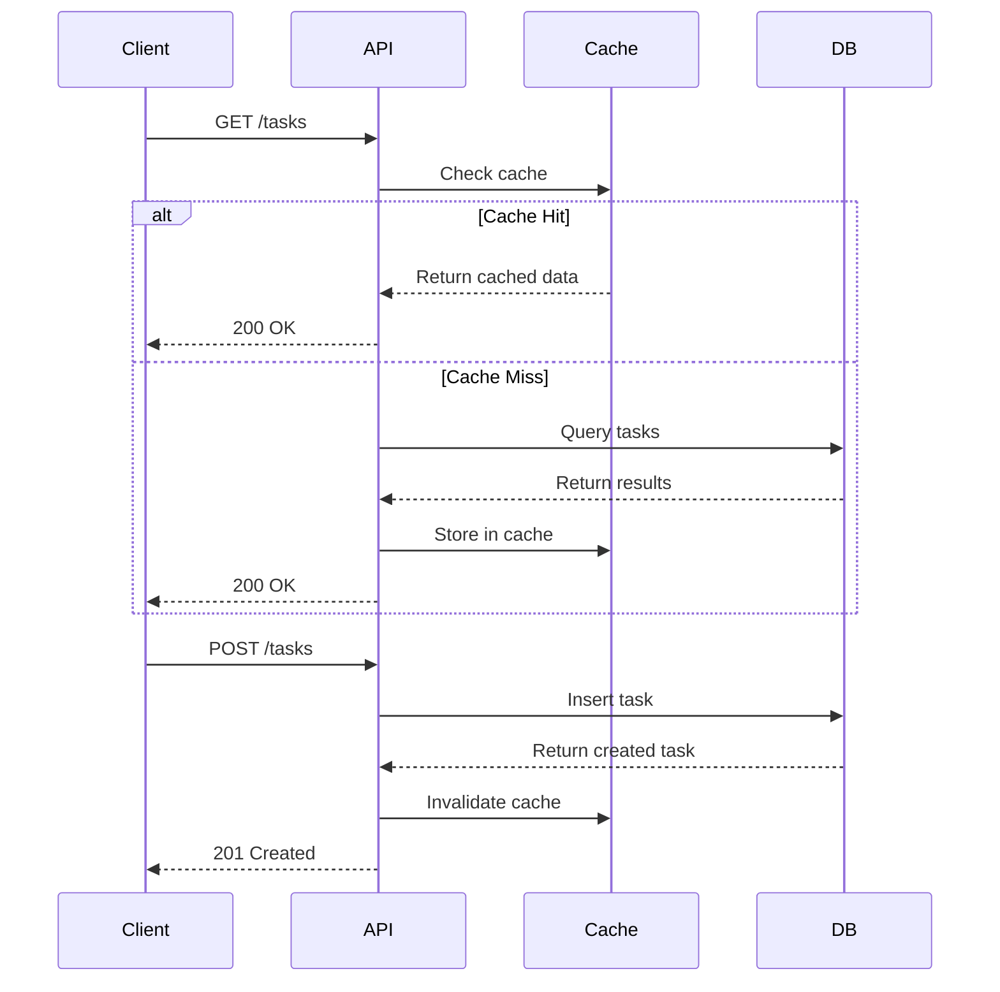

# Task Manager

A microservices task manager API built with Go, Gin, PostgreSQL, and Redis.

## Architecture



## Data Flow



## Project Structure

```
task-manager/
├── cmd/
│   └── serve.go          # CLI serve command
├── internal/
│   ├── domain/
│   │   ├── task.go       # Domain models
│   │   ├── repository.go # Repository interface
│   │   └── errors.go     # Domain errors
│   ├── repository/
│   │   ├── postgres.go   # PostgreSQL implementation
│   │   ├── cached.go     # Cache wrapper
│   │   └── mock.go       # Mock for testing
│   ├── handler/
│   │   ├── task.go       # HTTP handlers
│   │   ├── router.go     # Gin router setup
│   │   └── task_test.go  # Integration tests
│   ├── cache/
│   │   └── redis.go      # Redis cache implementation
│   ├── middleware/
│   │   └── metrics.go    # Prometheus metrics
│   └── metrics/
│       └── prometheus.go # Metrics endpoint
├── pkg/
│   └── database/
│       ├── db.go         # Database connection
│       └── migrations.go # SQL migrations
├── docs/
│   └── openapi.yaml      # OpenAPI 3.0 spec
├── scripts/
│   └── benchmark.sh      # Load test script
├── Dockerfile            # Multi-stage Docker build
├── docker-compose.yml    # Full stack with dependencies
├── config.yaml           # Application configuration
└── prometheus.yml        # Prometheus config
```

## Features

- **RESTful CRUD API** for task management
- **PostgreSQL** for persistent storage
- **Redis** for caching (cache-aside pattern with invalidation)
- **Pagination & filtering** by status and assignee
- **Prometheus metrics** (requests_total, request_latency, tasks_count)
- **OpenAPI 3.0** documentation
- **Docker** multi-stage build
- **Cobra** CLI with Viper configuration
- **70%+ test coverage** with unit and integration tests

## Quick Start

### Using Docker Compose (Recommended)

```bash
# Clone the repository
git clone https://github.com/graph/task-manager.git
cd task-manager

# Start all services
docker-compose up -d

# Check status
docker-compose ps
```

The API will be available at `http://localhost:8080`.

### Local Development

```bash
# Prerequisites
# - Go 1.24+
# - PostgreSQL 16+
# - Redis 7+

# Start database
docker-compose up -d postgres redis

# Run migrations and start server
go run . serve
```

## Configuration

Configuration is managed via Cobra flags, environment variables, or `config.yaml`:

| Flag | Env Var | Default | Description |
|------|---------|---------|-------------|
| `--port` | `TASK_PORT` | 8080 | Server port |
| `--host` | `TASK_HOST` | 0.0.0.0 | Server host |
| `--config` | - | ./config.yaml | Config file path |

Environment variables (prefix `TASK_`):
- `TASK_DB_HOST`, `TASK_DB_PORT`, `TASK_DB_USER`, `TASK_DB_PASSWORD`, `TASK_DB_NAME`
- `TASK_REDIS_ADDR`, `TASK_REDIS_PASSWORD`

## API Examples

### Create a Task

```bash
curl -X POST http://localhost:8080/tasks \
  -H "Content-Type: application/json" \
  -d '{"title": "Buy groceries", "assignee": "alice"}'
```

Response:
```json
{
  "id": 1,
  "title": "Buy groceries",
  "assignee": "alice",
  "status": "pending",
  "created_at": "2025-07-20T12:00:00Z",
  "updated_at": "2025-07-20T12:00:00Z"
}
```

### List Tasks with Filtering

```bash
# List all tasks
curl http://localhost:8080/tasks

# Filter by status
curl "http://localhost:8080/tasks?status=pending"

# Filter by assignee
curl "http://localhost:8080/tasks?assignee=alice"

# Pagination
curl "http://localhost:8080/tasks?page=2&page_size=10"
```

Response:
```json
{
  "tasks": [...],
  "total": 42
}
```

### Get Task by ID

```bash
curl http://localhost:8080/tasks/1
```

### Update Task

```bash
curl -X PUT http://localhost:8080/tasks/1 \
  -H "Content-Type: application/json" \
  -d '{"status": "done"}'
```

### Delete Task

```bash
curl -X DELETE http://localhost:8080/tasks/1
```

### Health Check

```bash
curl http://localhost:8080/health
```

## Testing

```bash
# Run all tests
go test ./... -v

# Run with coverage
go test ./... -coverprofile=coverage.out
go tool cover -html=coverage.out

# Run specific test
go test ./internal/repository/ -v -run TestMockTaskRepository
```

## Load Testing

```bash
# Run benchmark script
./scripts/benchmark.sh

# Or use Apache Bench directly
ab -n 1000 -c 50 http://localhost:8080/tasks
```

## Monitoring

- **Prometheus**: http://localhost:9090
- **Application Metrics**: http://localhost:8080/metrics

### Available Metrics

| Metric | Type | Description |
|--------|------|-------------|
| `http_requests_total` | Counter | Total HTTP requests |
| `http_request_latency_seconds` | Histogram | Request latency |
| `tasks_count` | Gauge | Total tasks |

## Trade-offs

### Decisions Made

1. **PostgreSQL over SQLite**: Chosen for production readiness and concurrent access support
2. **Redis caching**: Added for read-heavy workloads, uses cache-aside pattern with invalidation
3. **In-memory mock repository**: Used for fast unit tests without database dependencies
4. **Multi-stage Docker build**: Reduces final image size from ~800MB to ~15MB
5. **Cobra/Viper**: Industry standard for Go CLI tools, supports multiple config sources

### Architecture Choices

1. **Repository pattern**: Clean separation between business logic and data access
2. **Handler-Service-Repository layers**: Standard Go project layout
3. **Middleware for metrics**: Non-intrusive observability
4. **Cache wrapper**: Transparent caching without changing repository interface

## License

MIT
