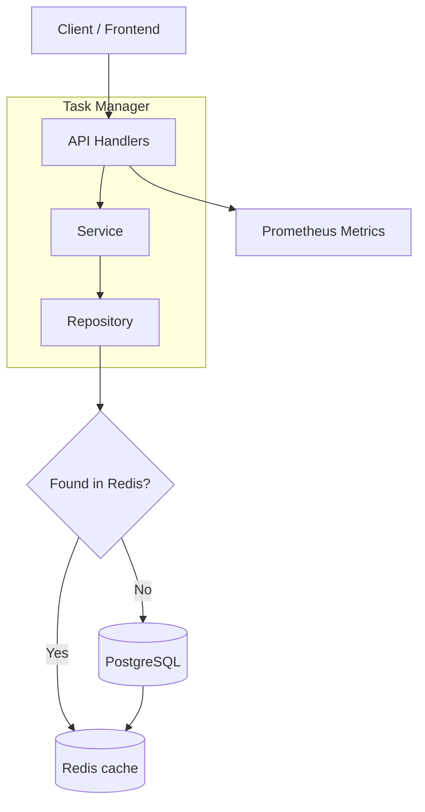

# Task Manager

A microservices task manager API built with Go, Gin, PostgreSQL, and Redis.

## Architecture



## Quick Start

```bash
# Clone the repository
git clone https://github.com/graph/tsk.git
cd tsk

# Create .env from example (if not exists)
make env

# Build and start all services
make build-up

# Check status
make status
```

The API will be available at `http://localhost:8000`.

The swagger is at the `http://localhost:8000/swagger/index.html`
The swagger is at the [http://0.0.0.0:8000/swagger/index.html](`http://0.0.0.0:8000/swagger/index.html`)].


### Local Development

```bash
# Prerequisites
# - Go 1.24+
# - PostgreSQL 16+
# - Redis 7+

# Start database and redis
docker compose up -d postgres redis

# Create .env and run server
make env
go run . serve
```

## API Examples

### Create a Task

```bash
curl -X POST http://localhost:8000/tasks \
  -H "Content-Type: application/json" \
  -d '{"title": "Buy groceries", "assignee": "alice"}'
```

Response:
```json
{
  "id": 1,
  "title": "Buy groceries",
  "assignee": "alice",
  "status": "pending",
  "created_at": "2025-07-20T12:00:00Z",
  "updated_at": "2025-07-20T12:00:00Z"
}
```

### List Tasks with Filtering

```bash
# List all tasks
curl http://localhost:8000/tasks

# Filter by status
curl "http://localhost:8000/tasks?status=pending"

# Filter by assignee
curl "http://localhost:8000/tasks?assignee=alice"

# Pagination
curl "http://localhost:8000/tasks?page=2&page_size=10"
```

Response:
```json
{
  "tasks": [...],
  "total": 42
}
```

### Get Task by ID

```bash
curl http://localhost:8000/tasks/1
```

### Update Task

```bash
curl -X PUT http://localhost:8000/tasks/1 \
  -H "Content-Type: application/json" \
  -d '{"status": "done"}'
```

### Delete Task

```bash
curl -X DELETE http://localhost:8000/tasks/1
```

### Health Check

```bash
curl http://localhost:8000/health
```

## Testing

### Unit Tests

```bash
# Run all unit tests
go test ./... -short -v

# Run tests for a specific package
go test ./internal/service/taskservice/ -v
go test ./internal/handler/ -v
go test ./internal/config/ -v

# Run a specific test by name
go test ./internal/handler/ -v -run TestCreateTask
```

### Integration Tests

Integration tests require running PostgreSQL and Redis (via `make up` or `docker compose up -d`).

```bash
# Run integration tests (PostgreSQL + Redis required)
make test-integration

# Or run directly
go test ./internal/repository/postgres/... ./pkg/database/... -v
```

### Coverage

```bash
# Generate coverage report
go test ./... -short -coverprofile=coverage.out

# View coverage summary
go tool cover -func=coverage.out

# Open coverage in browser (HTML)
go tool cover -html=coverage.out -o coverage.html
open coverage.html
```

### All Tests (via Make)

```bash
# Run all unit tests
make test

# Run integration tests
make test-integration

# Run tests with coverage
make test-coverage
```

## Load Testing

```bash
# Run benchmark script (uses curl, no extra tools needed)
./scripts/benchmark.sh
```

## Monitoring

- **Prometheus**: http://localhost:9090
- **Application Metrics**: http://localhost:8000/metrics

### Available Metrics

| Metric | Type | Description |
|--------|------|-------------|
| `http_requests_total` | Counter | Total HTTP requests |
| `http_request_latency_seconds` | Histogram | Request latency |
| `tasks_count` | Gauge | Total tasks |
